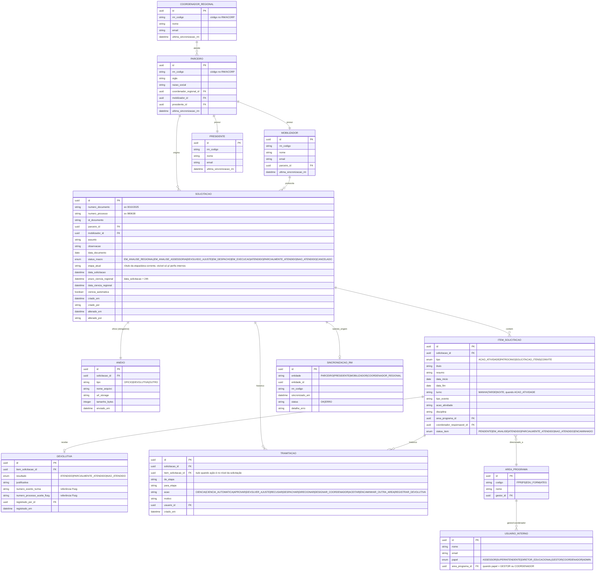

# Modelo de Dados — Protocolo de Ofício

## 1. Diagrama de entidades



## 2. Regras de integridade derivadas da hierarquia de negócio

- `PARCEIRO.coordenador_regional_id` obrigatório, não editável via UI (somente sincronização RM).
- `PARCEIRO.mobilizador_id` obrigatório e único (1:1) — um Mobilizador não pode estar associado a mais de um Parceiro simultaneamente; `MOBILIZADOR.parceiro_id` é a mesma relação vista do outro lado.
- `PARCEIRO.presidente_id` obrigatório (1:1 vigente; histórico de presidentes anteriores não é mantido nesta versão, apenas o vigente).
- Todas as tabelas de origem RM (`COORDENADOR_REGIONAL`, `PARCEIRO`, `PRESIDENTE`, `MOBILIZADOR`) são **somente leitura** para usuários finais; escrita ocorre exclusivamente pelo processo de sincronização (`SINCRONIZACAO_RM`).
- `SOLICITACAO.mobilizador_id` deve pertencer ao mesmo `parceiro_id` da solicitação (constraint de aplicação, validada no service, não apenas no banco).
- `ITEM_SOLICITACAO.area_programa_id` só é preenchido a partir da etapa "Diretor Educacional" (HU05); antes disso é nulo.
- `TRAMITACAO` é **append-only** — nenhuma linha é atualizada ou apagada (auditoria imutável).

## 3. Status macro × status de item

O `status_macro` da `SOLICITACAO` é **derivado**, nunca definido diretamente pelo usuário quando o resultado é `ATENDIDO | PARCIALMENTE_ATENDIDO | NAO_ATENDIDO`:

```
todosItens(status_item em [ATENDIDO])                → ATENDIDO
todosItens(status_item em [NAO_ATENDIDO])             → NAO_ATENDIDO
todosItens(status_item finalizado) e misto            → PARCIALMENTE_ATENDIDO
algumItem(status_item em [PENDENTE, EM_ANALISE, ENCAMINHADO]) → mantém status_macro de tramitação (etapa_atual reflete onde está)
```

## 4. Seed de referência (para ambiente de desenvolvimento)

Baseado nos exemplos do PDF, usado nas migrations de seed:

- Parceiro `FAEG` — Presidente `Eduardo Araújo` — Mobilizador `Marcos Santos`.
- Áreas/Programas e gestores: ver tabela em `requirements.md` §4 (HU05).
- Processo de exemplo: `Processo 980638`, `ID Documento 2359310`, `Documento 0010/2025`.
